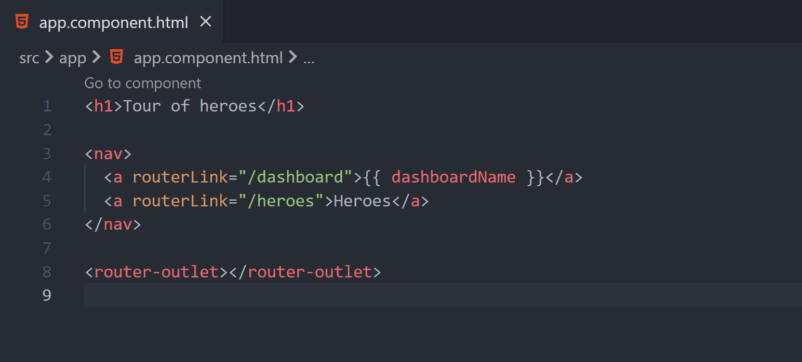

<h1 align="center">
  <br>
    
  <br><br>
  Angular Component Extractor
  <br>
  <br>
</h1>

<h4 align="center">Extract Angular Components based on editor selection</h4>

## Description

This extension for VS Code makes it easier to split components in an Angular project. Within a template you can select the part which should be extracted. Then another component is generated in the same directory using the Angular CLI.

## How to use



## Configuration

Angular generates components with a prefix. This prefix can be customized via VS Code settings:

```json
{
  "angular-component-extractor.default-prefix": "app"
}
```

## Angular CLI

The extension is using [Angular CLI](https://angular.io/cli) under the hood. If the CLI is not installed it will execute it via NPX. In general, it's recommended to install the Angular CLI on the system to get a better performance of this extension:

```
npm install -g @angular/cli
```
