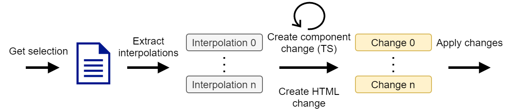

# How the angular-component-extractor works

When the extension is triggered, then it first reads the currently selected content of the html file.
After ensuring that all requirements for a successful execution are met (see `Startup Requirements`), the following steps are processed:

1. Extract interpolation
2. Create one `update change` for each interpolation which adds a `@Input` to the new component ts
3. Create one `replace change` for the new component html, which inserts the selection
4. Provide the replacement for the selected html
5. Apply changes

# Startup Requirements

- Angular Language Service is available
- The selected range has no errors (Diagnostic messages)

# Architecture goal

The goal of the application architecture is to be decoupled it from vscode whenever possible. 
Hence, the `VSCodeAbstraction` namespace  was created to decouple it via interfaces. 
This approach allows us to test the code without actually starting vscode.
The actual logic is within the `src/angular` directory while the others contain either cross functional or vscode dependent code.

# Concept behind `Changes`

The idea behind `Changes` (`src/types/index.ts > Changes`) is to define what needs to be done in order to extract the component, but without actually doing it.
This enables us to test it freely without mocking anything, as we only need to provide the selection, directory and component name to get changes.

But there are changes which are dynamic. For example when extending the generated component ts with the `@Input` properties. Thats why there are two types of changes. 

1. update file changes
2. replace file changes

As the names imply, one changes the content of a file, while the other replaces it.
